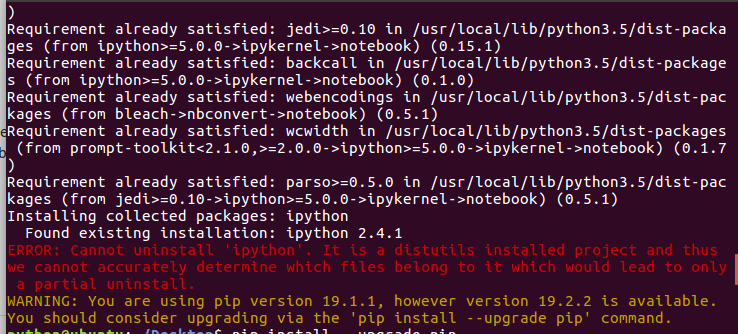

本来打算使用下jupyter notebook，结果运行时报错了


然后，尝试卸载重装

```shell
sudo -H pip uninstall jupyter notebook
sudo -H pip install jupyter notebook
```

安装时又提示错误`Cannot uninstall 'ipython'`

直接使用命令安装ipython `pip install ipython`，发现并没有解决问题

最终搜索到解决方法，运行下面的命令强制更新，更新完成后，重新打开jupyter notebook成功。

```shell
sudo pip3 install --ignore-installed ipython --upgrade
```

<br>

参考链接： https://www.jianshu.com/p/94caf01dd9a6

